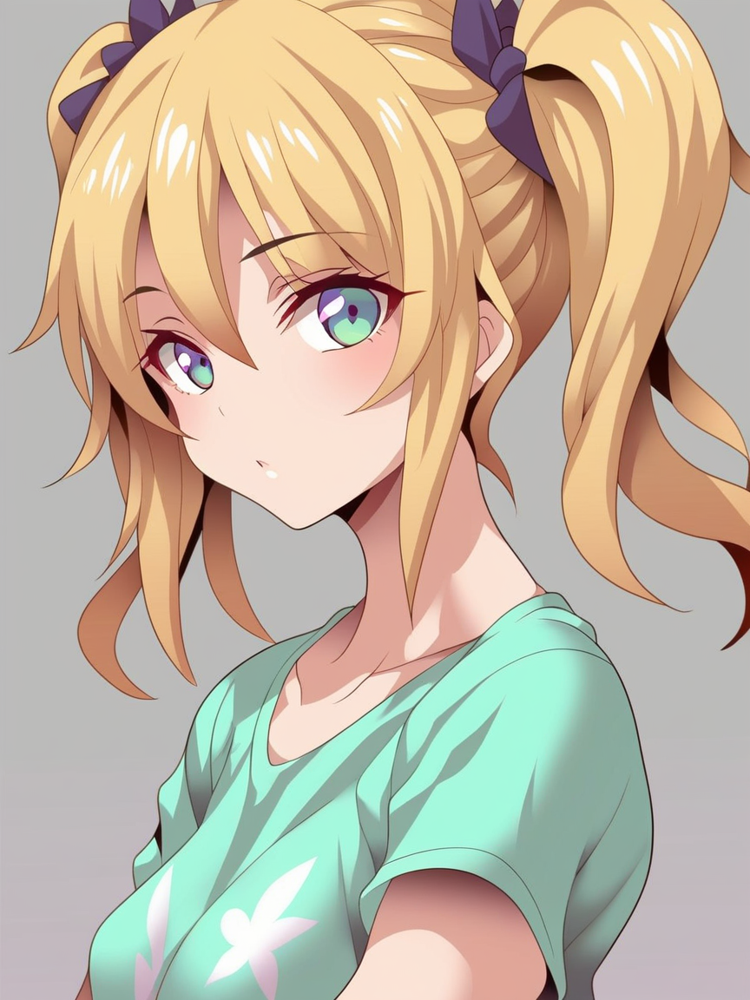

# Pony Diffusion Style Comparisons - PonyDiffusion V6 "Claire"

|         |                                                                                         |
|---------|-----------------------------------------------------------------------------------------|
| Model   | [PonyDiffusion V6](https://civitai.com/models/257749/pony-diffusion-v6-xl)              |
| Subject | "Claire"; Random build-in female subject - `1girl`, `twintails`, `blonde hair`, `shirt` |

```
score_9, score_8_up, score_7_up, score_6_up, score_5_up, score_4_up, source_cartoon, source_anime,
<style>,
1girl, twintails, blonde hair, shirt, upper body, looking at viewer,
Negative prompt: censored, blindfold, furry, bad anatomy, bad, sketch, low quality, lowres, text, watermark, patreon
Steps: 25, Sampler: Euler a, CFG scale: 7, Seed: 26029763, Size: 864x1152, Model hash: 1681bf15ca, Model: js2prony_v10, VAE hash: 63aeecb90f, VAE: sdxl_vae.safetensors, Clip skip: 2, Style Selector Enabled: True, Style Selector Randomize: False, Style Selector Style: base, Version: v1.7.0
```

| Style                       | Base           | Style                              | Attention Heatmap                     |
|-----------------------------|----------------|------------------------------------|---------------------------------------|
| `23_(real_xxiii)`           |  | .png)           | .hm.png)           |
| `aaaa_quad-a`               |  | .png)             | .hm.png)             |
| `agawa_ryou`                |  |                 |                 |
| `agm`                       |  |                        |                        |
| `akano_murasaki`            |  |             |             |
| `akashio_(loli_ace)`        |  | .png)        | .hm.png)        |
| `akinbo_(hyouka_fuyou)`     |  | .png)     | .hm.png)     |
| `alp`                       |  |                        |                        |
| `amano_kozue`               |  |                |                |
| `amasora_taichi`            |  |             |             |
| `asamura hiori`             |  |              |              |
| `aster_crowley`             |  |              |              |
| `asura_asurauser`           |  | .png)         | .hm.png)         |
| `aztodio`                   |  |                    |                    |
| `bb_(baalbuddy)`            |  | .png)            | .hm.png)            |
| `bee_(deadflow)`            |  | .png)            | .hm.png)            |
| `bittenhard`                |  |                 |                 |
| `blade_(galaxist)`          |  | .png)          | .hm.png)          |
| `boris_(noborhys)`          |  | .png)          | .hm.png)          |
| `chanta_(ayatakaoisii)`     |  | .png)     | .hm.png)     |
| `cian_yo`                   |  |                    |                    |
| `cle_masahiro`              |  |               |               |
| `cutesexyrobutts`           |  |            |            |
| `cyancapsule`               |  |                |                |
| `damao_yu`                  |  |                   |                   |
| `dandon_fuga`               |  |                |                |
| `dd_(ijigendd)`             |  | .png)             | .hm.png)             |
| `donguri_suzume`            |  |             |             |
| `dross`                     |  |                      |                      |
| `elf_(stroll_in_the_woods)` |  | .png) | .hm.png) |
| `em_(totsuzen_no_hakike)`   |  | .png)   | .hm.png)   |
| `fadingz`                   |  |                    |                    |
| `firolian`                  |  |                   |                   |
| `fumihiko_(fu_mihi_ko)`     |  | .png)     | .hm.png)     |
| `fumio_(rsqkr)`             |  | .png)             | .hm.png)             |
| `fuya_(tempupupu)`          |  | .png)          | .hm.png)          |
| `geo_(yukishitadou)`        |  | .png)        | .hm.png)        |
| `hanamasa_ono`              |  |               |               |
| `haneramu`                  |  |                   |                   |
| `happoubi_jin`              |  |               |               |
| `hara_(harayutaka)`         |  | .png)         | .hm.png)         |
| `haru_(hiyori-kohal)`       |  | .png)       | .hm.png)       |
| `hekiga_(freelot)`          |  | .png)          | .hm.png)          |
| `hews`                      |  |                       |                       |
| `hisakawa_chin`             |  |              |              |
| `homare_(fool's_art)`       |  | .png)       | .hm.png)       |
| `horosuke`                  |  |                   |                   |
| `hua-j`                     |  |                      |                      |
| `ichirino_minagi`           |  |            |            |
| `incase`                    |  |                     |                     |
| `iro_ame_(amewaagada)`      |  | .png)      | .hm.png)      |
| `jabara_tornado`            |  |             |             |
| `jack_dempa`                |  |                 |                 |
| `jellytits-7`               |  |                |                |
| `joy_ride`                  |  |                   |                   |
| `kairunoburogu`             |  |              |              |
| `kaisen_chuui`              |  |               |               |
| `kame_(kamepan44231)`       |  | .png)       | .hm.png)       |
| `kamimiya`                  |  |                   |                   |
| `kapuru_0410`               |  |                |                |
| `kase_daiki`                |  |                 |                 |
| `kashu_(hizake)`            |  | .png)            | .hm.png)            |
| `kasumi_(skchkko)`          |  | .png)          | .hm.png)          |
| `kawakami_rokkaku`          |  |           |           |
| `kawamoto_toshihiro`        |  |         |         |
| `kelvin_hiu`                |  |                 |                 |
| `kokura_masashi`            |  |             |             |
| `konno_tohiro`              |  |               |               |
| `kurokaze_no_sora`          |  |           |           |
| `kurokoshou_(emuburemu123)` |  | .png) | .hm.png) |
| `lambda_(kusowarota)`       |  | .png)       | .hm.png)       |
| `liang_xing`                |  |                 |                 |
| `lm_(legoman)`              |  | .png)              | .hm.png)              |
| `m-da_s-tarou`              |  |               |               |
| `mana_kakkowarai`           |  |            |            |
| `masami_chie`               |  |                |                |
| `melkor_mancin`             |  |              |              |
| `minakami_(flyingman555)`   |  | .png)   | .hm.png)   |
| `minato_ojitan`             |  |              |              |
| `mirai_hikari`              |  |               |               |
| `mitsumi_misato`            |  |             |             |
| `miyase_mahiro`             |  |              |              |
| `miyuki_(miyuki0529)`       |  | .png)       | .hm.png)       |
| `mizuryu_kei`               |  |                |                |
| `mizuumi_(bb)`              |  | .png)              | .hm.png)              |
| `mo_(kireinamo)`            |  | .png)            | .hm.png)            |
| `moisture_(chichi)`         |  | .png)         | .hm.png)         |
| `momo_no_sukebe`            |  |             |             |
| `mosho`                     |  |                      |                      |
| `mugi_(banban53)`           |  | .png)           | .hm.png)           |
| `mugichoko_(mugi_no_choko)` |  | .png) | .hm.png) |
| `murakami_suigun`           |  |            |            |
| `nagase_haruhito`           |  |            |            |
| `nakamura_regura`           |  |            |            |
| `nakamura_rohane`           |  |            |            |
| `neisan`                    |  |                     |                     |
| `nemunemu_(candy_paddle)`   |  | .png)   | .hm.png)   |
| `neoartcore`                |  |                 |                 |
| `neocoill`                  |  |                   |                   |
| `nijihashi_sora`            |  |             |             |
| `niliu_chahui`              |  |               |               |
| `nottytiffy`                |  |                 |                 |
| `null_(nyanpyoun)`          |  | .png)          | .hm.png)          |
| `nyong_nyong`               |  |                |                |
| `nyonyonba_tarou`           |  |            |            |
| `nyororiso_(muyaa)`         |  | .png)         | .hm.png)         |
| `osiimi`                    |  |                     |                     |
| `paloma_piquet`             |  |              |              |
| `personal_ami`              |  |               |               |
| `pija_(pianiishimo)`        |  | .png)        | .hm.png)        |
| `ririko_(zhuoyandesailaer)` |  | .png) | .hm.png) |
| `sagiri`                    |  |                     |                     |
| `sakura_hanpen`             |  |              |              |
| `sano_toshihide`            |  |             |             |
| `shimashiro_itsuki`         |  |          |          |
| `shirokuma_(nankyoku)`      |  | .png)      | .hm.png)      |
| `shiromoru_(yozakura_rety)` |  | .png) | .hm.png) |
| `sima_naoteng`              |  |               |               |
| `sousouman`                 |  |                  |                  |
| `sparrow`                   |  |                    |                    |
| `stealth-brock`             |  |              |              |
| `sumiyao_(amam)`            |  | .png)            | .hm.png)            |
| `sunga2usagi`               |  |                |                |
| `sunna_(nilsunna)`          |  | .png)          | .hm.png)          |
| `taka_(taka_wo_kukuru)`     |  | .png)     | .hm.png)     |
| `tebi_(tbd11)`              |  | .png)              | .hm.png)              |
| `tomose_shunsaku`           |  |            |            |
| `tomu_(tomubobu)`           |  | .png)           | .hm.png)           |
| `tony_guisado`              |  |               |               |
| `tony_taka`                 |  |                  |                  |
| `tsukishiro_saika`          |  |           |           |
| `tsukiyo_(skymint)`         |  | .png)         | .hm.png)         |
| `vahn_yourdoom`             |  |              |              |
| `wagashi_(dagashiya)`       |  | .png)       | .hm.png)       |
| `yanyan_(shinken_gomi)`     |  | .png)     | .hm.png)     |
| `yoi_naosuke`               |  |                |                |
| `yomu_(sgt_epper)`          |  | .png)          | .hm.png)          |
| `ziro_(zirorong)`           |  | .png)           | .hm.png)           |